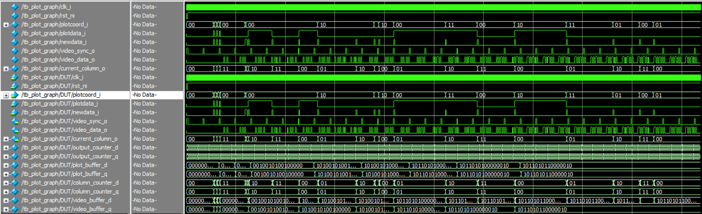
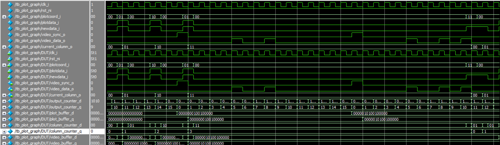
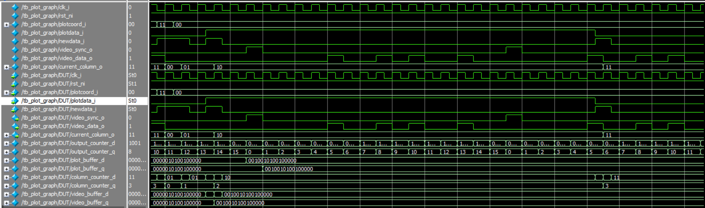
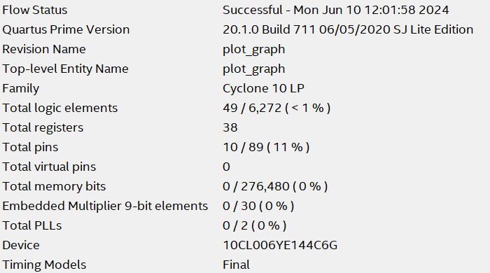

# FPGA-RealTime-Display
Questo progetto SystemVerilog implementa un sistema di controllo basato su FPGA per la gestione di un display 4x4 pixel, utilizzando dati ricevuti dinamicamente.

L'FPGA controlla il display generando i segnali **VIDEO_SYNC** e **VIDEO_DATA** per la visualizzazione dei pixel e aggiorna il contenuto dello schermo sulla base dei dati ricevuti tramite i segnali **NEWDATA**, **PLOTDATA** e **PLOTCOORD**.

## Funzionamento del Sistema

### Ricezione dei Dati
- Quando il segnale **NEWDATA** è alto per un ciclo di clock, un nuovo dato viene ricevuto sulle porte **PLOTCOORD** e **PLOTDATA**.
- **PLOTCOORD** indica la riga del pixel da aggiornare.
- **PLOTDATA** definisce il colore del pixel:
  - `1` = nero
  - `0` = bianco

### Generazione del Segnale Video
- Il display ha una risoluzione **4x4 pixel**.
- Ogni schermata viene generata in **16 cicli di clock**:
  - Nel **primo ciclo**, il segnale **VIDEO_SYNC** viene attivato per segnalare l'inizio di una nuova schermata.
  - Nei **successivi 15 cicli**, il segnale **VIDEO_DATA** trasmette i valori dei pixel riga per riga, da sinistra a destra e dall'alto verso il basso.

### Aggiornamento del Display
- Il valore di **PLOTDATA** viene scritto nella colonna **i MOD 4**, mantenendo intatti i valori nelle altre colonne.
- Il valore della colonna corrente viene inviato in uscita sul segnale **CURRENT_COLUMN**.
- Il display si aggiorna continuamente senza pause tra una schermata e la successiva.

### Frequenza massima

480.307MHz

### Forme d'onda di simulazione

### Sintesi e timing in Quartus

